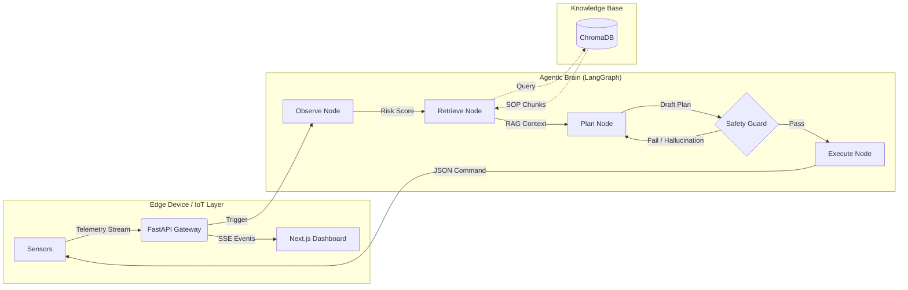

<div align="center">
  <h1>🛡️ NEXUS-OMNIGUARD (智巡护航)</h1>
  <h3>工业级具身智能巡检决策中枢</h3>

  <p>
    <b>基于 LangGraph 状态机与 RAG 知识库构建的可落地 LLM 智能体架构</b>
  </p>

  []()
  []()
  []()
  []()
  []()
  []()

</div>

---

## 📺 演示视频 (Demo)


---

## 🏗️ 核心架构 (Architecture)

本项目采用 **Multi-Agent System** 架构，实现了从**数据感知**到**决策执行**的全流程闭环。系统核心是一个由 **LangGraph** 驱动的确定性有限状态机（FSM），确保在复杂的工业环境中，AI 的行为始终可控、可解释、可追溯。



### 📂 目录结构解析

- **`/backend`**: 智能体核心逻辑
  - `app/core/agent_graph.py`: **大脑核心**。定义了 LangGraph 的状态流转（感知->检索->规划->校验）。
  - `app/core/rag_engine.py`: **记忆模块**。基于 ChromaDB 实现的 RAG 引擎，负责 SOP 文档的切片与向量检索。
  - `app/simulator`: **环境模拟**。生成高盐雾、危化品泄漏等极端场景的传感器数据。
- **`/frontend`**: 交互式看板
  - 基于 Next.js + Tailwind CSS，实时展示推理思维链（Chain of Thought）与传感器波形。
- **`/docs`**: 知识库源文件
  - 包含 20+ 份真实的 Markdown 格式巡检手册（SOP），是 Agent 决策的法律依据。

---

## 🧠 底层逻辑拆解 (Under the Hood)

### 1. 感知层：多模态数据融合 (Observe)
- **模拟器 (`sensor_simulator.py`)**: 系统内置了一个高保真的物理环境模拟器，能够生成温度、湿度、VOC（挥发性有机物）、盐雾浓度等多种传感器时序数据。
- **风险量化**: Agent 首先对遥测数据进行清洗，计算 `Risk Score`（风险评分）。例如，当 `VOC > 1.0 mg/m³` 时，系统会自动标记为“高危场景”，并触发紧急模式。

### 2. 记忆层：工业级 RAG 检索引擎 (Retrieve)

为了解决通用大模型“不懂厂规”和“幻觉”问题，我们构建了一套深度定制的 RAG（Retrieval-Augmented Generation）引擎，**这也是本项目的核心亮点之一**。

*   **SOP 结构化切片 (Structure-Aware Chunking)**:
    *   不同于简单的按字符数切片，我们实现了**按 Markdown 标题层级**切片。
    *   例如，将 `## 3. 盐雾处理流程` 下的所有段落聚合为一个 Chunk，确保 LLM 检索时能获得完整的上下文，而不是支离破碎的句子。
    *   系统启动时，会自动扫描 `/docs` 目录，重建向量索引。

*   **离线隐私保护 (Offline & Private)**:
    *   使用 `sentence-transformers` (all-MiniLM-L6-v2) 在本地生成 Embedding。
    *   数据存储在本地 `ChromaDB`，**核心 SOP 资料无需上传云端**，完全满足工业数据出境/上云的合规要求。

*   **动态查询生成 (Dynamic Query Generation)**:
    *   当感知层发现异常（如 `VOC=1.5`），Agent 会将结构化数据转化为语义 Query（如 *"VOC浓度超标时的应急处理流程"*）。
    *   系统检索出 Top-3 最相关的 SOP 条款，注入到 Prompt 的 Context 窗口中，强制 LLM "基于检索到的文档回答"。

### 3. 认知层：思维链规划 (Plan)
- **Prompt Engineering**: 我们设计了包含 `Role`（角色）、`Task`（任务）、`Constraint`（约束）的结构化 Prompt。
- **LLM 推理**: Agent 结合**实时数据**与**检索到的 SOP 条款**，生成一段包含 `Thought`（思考过程）与 `Action`（行动指令）的 JSON。
  > *思考示例：“检测到盐雾浓度 18mg/m³，根据 SOP-07 条款 3.2，应立即启动自清洁程序并撤离至干燥区。”*

### 4. 安全层：确定性防御 (Safety Guard)
- **反幻觉机制**: LLM 生成的指令必须经过 `safety_guard` 节点的校验。
- **硬编码规则**: 系统内置了正则表达式与黑名单。例如，如果 LLM 建议“打开所有阀门”但未通过权限校验，或者指令参数超出硬件极限（如速度 > 2.0m/s），**Safety Guard 会直接拦截指令，并强制 Agent 重新规划（Re-plan）**，直到输出合规为止。

---

## 🚀 快速开始 (Quick Start)

### 方式一：Docker 一键启动 (推荐)

```bash
# 1. 克隆仓库
git clone https://github.com/a0982868339-ship-it/LogisticsDemo.git
cd LogisticsDemo

# 2. 配置环境变量
cp backend/.env.example backend/.env
# 编辑 backend/.env 填入你的 OPENAI_API_KEY

# 3. 启动服务
docker compose up --build
```

访问 `http://localhost:3000` 即可看到控制台。

### 方式二：本地开发模式

**后端 (Python 3.11+)**
```bash
cd backend
python -m venv .venv
source .venv/bin/activate
pip install -r requirements.txt
python -m uvicorn app.main:app --reload --port 8000
```

**前端 (Node.js 18+)**
```bash
cd frontend
npm install
npm run dev
```

---

## 🛠️ 技术栈 (Tech Stack)

| 模块 | 技术选型 | 说明 |
| :--- | :--- | :--- |
| **LLM Orchestration** | **LangGraph** | 实现有状态、可循环、可纠错的 Agent 编排 |
| **Backend Framework** | **FastAPI** | 高性能异步 Python Web 框架 |
| **Vector DB** | **ChromaDB** | 本地轻量级向量数据库，用于 RAG |
| **Frontend** | **Next.js 14** | App Router, Server Components |
| **Styling** | **Tailwind CSS** | 现代化 UI 样式库 |
| **E2E Testing** | **Playwright** | 自动化端对端测试 |
| **Deployment** | **Docker & K8s** | 容器化与集群部署支持 |

---

**Made with ❤️ by [yangyangyang]**
