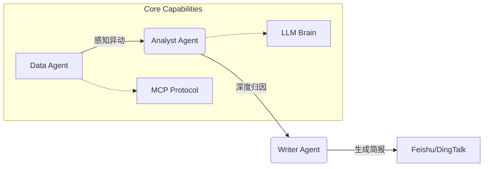

# AI DataPulse: 基于 OpenClaw 的 O2O 业务异动诊断 Agent 🤖

> **全流程 2 小时闭环开发** | **95% AI 生成代码** | **集成 MCP 协议与飞书预警**

[]()
[]()
[]()
[]()
[]()
[]()

AI DataPulse 是一个**自主式数据分析 Agent**，专为解决 O2O 业务（如三亚外卖、打车）中的**数据感知滞后**与**异动归因困难**痛点而生。

它不仅仅是一个数据看板，更是一个**虚拟专家团队**：
- **Data Agent** 负责通过 MCP 协议主动抓取数据；
- **Analyst Agent** 负责结合天气、流量等多维因子进行深度归因；
- **Writer Agent** 负责生成专业简报并推送至飞书群。

---

## 📺 演示视频 (Demo)

> [点击查看 演示录屏]! https://github.com/user-attachments/assets/7435bed7-f65a-49b2-9983-278f774982bd

---

## 🏗️ 核心架构 (Architecture)

本项目采用 **Multi-Agent System** 架构，实现了从数据感知到行动建议的全流程闭环。



### 目录结构
- `/backend`: 核心 Agent 逻辑 (FastAPI + LangGraph)
- `/frontend`: 实时看板 (Next.js)
- `/docs`: 知识库 (SOP Markdown)
- `/k8s`: 容器编排配置

---

## 🚀 快速开始 (Quick Start)

### 1. 克隆仓库
```bash
git clone https://github.com/a0982868339-ship-it/LogisticsDemo.git
cd LogisticsDemo
```

### 2. 后端启动 (Python/FastAPI)
```bash
cd backend
python -m venv .venv
source .venv/bin/activate
pip install -r requirements.txt
cp .env.example .env  # 配置 OPENAI_API_KEY
python -m uvicorn app.main:app --reload --port 8000
```

### 3. 前端启动 (Node/Next.js)
```bash
cd frontend
npm install
npm run dev
```

访问 `http://localhost:3000` 即可开始诊断。

---

## 💡 核心亮点 (Highlights)

1. **状态机驱动的高可靠 Agent 编排 (Powered by LangGraph)**：
   物理世界的排障容不得大模型出现“一次性赌博”式的幻觉。我们利用 LangGraph 将核心 Agent 抽象为严格的图结构状态机：`[感知 -> 检索 -> 规划 -> 验证 -> 输出]`。
   
2. **深度定制的工业级 RAG (ChromaDB + 离线 Embedding)**：
   通用大模型不懂单家企业的独家厂规，**本项目通过 RAG 架构完美解决了工业级应用最重要的“长尾知识”和“数据隐私”痛点。**

3. **坚如磐石的安全底线 (Deterministic Safety Guard)**：
   即使 GPT 偶发严重幻觉（例如下令：带电喷水降温），硬编码的正则表达式和黑名单安全栅栏也会立刻阻断指令，确保下发至硬件的指令 **100% 满足工业安全规范**。

---

## 🛠️ 技术栈 (Tech Stack)
- **Frontend**: Next.js (App Router), TailWindCSS
- **Backend**: FastAPI, LangGraph, ChromaDB
- **Infrastructure**: Docker, Kubernetes

---

**Made with ❤️ by [Your Name]**
