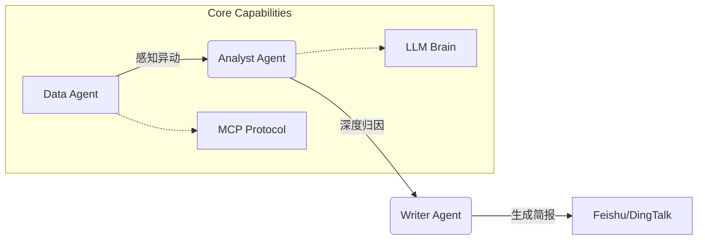

# AI DataPulse: 基于 OpenClaw 的 O2O 业务异动诊断 Agent 🤖

> **全流程 2 小时闭环开发** | **95% AI 生成代码** | **集成 MCP 协议与飞书预警**

AI DataPulse 是一个**自主式数据分析 Agent**，专为解决 O2O 业务（如三亚外卖、打车）中的**数据感知滞后**与**异动归因困难**痛点而生。

它不仅仅是一个数据看板，更是一个**虚拟专家团队**：
- **Data Agent** 负责通过 MCP 协议主动抓取数据；
- **Analyst Agent** 负责结合天气、流量等多维因子进行深度归因；
- **Writer Agent** 负责生成专业简报并推送至飞书群。

---

## 📺 演示视频 (Demo)

> [点击查看 演示录屏]! https://github.com/user-attachments/assets/7435bed7-f65a-49b2-9983-278f774982bd


---

## 🏗️ 核心架构 (Architecture)

本项目采用 **Multi-Agent System** 架构，实现了从数据感知到行动建议的全流程闭环。



### 目录结构
- `/agents`: 核心 Agent 逻辑 (Data, Analyst, Writer)
- `/skills`: 定制化业务逻辑函数 (如环比计算、异动判定)
- `/prompts`: 精心编排的 System Prompts (体现 Prompt Engineering)
- `/mcp`: 模拟 MCP Server 实现 (Model Context Protocol)
- `/data`: 仿真业务数据 (含 3月8日 女神节暴雨场景)

---

## 🚀 快速开始 (Quick Start)

### 1. 克隆仓库
```bash
git clone https://github.com/a0982868339-ship-it/LogisticsDemo.git
cd LogisticsDemo
# (以下命令视具体项目结构调整，示例假设是 Node 项目)
npm install 
```

### 2. 配置环境
复制 `.env.example` 为 `.env`，并填入你的 API Key：
```bash
GEMINI_API_KEY=your_key_here
FEISHU_WEBHOOK=your_webhook_url
```

### 3. 运行诊断
模拟 2026年3月8日（女神节+暴雨）的业务场景：
```bash
node main.js 2026-03-08 分析日报
```

你将看到终端输出详细的 Agent 思考过程，并在飞书收到一份红色的 **[异动警报]**。

---

## � 核心亮点 (Highlights)

1.  **主动感知 (Active Sensing)**: 不再等待人工投喂，Agent 通过 MCP 协议主动读取数据库/API。
2.  **深度思考 (Deep Reasoning)**: 告别简单的 "GMV 下跌 10%"，Agent 会告诉你 "因为暴雨导致运力崩盘，取消率飙升 8.5%"。
3.  **多模态闭环 (Closing the Loop)**: 分析结果直接转化为行动建议（如“提升骑手补贴”），并推送至决策者手机。

---

## 🛠️ 技术栈 (Tech Stack)
- **Runtime**: Node.js, Python
- **LLM**: Gemini 2.0 Flash / OpenAI GPT-4
- **Protocol**: MCP (Model Context Protocol)
- **Integration**: Feishu/Lark Webhook

---

**Made with ❤️ by [Your Name]**
